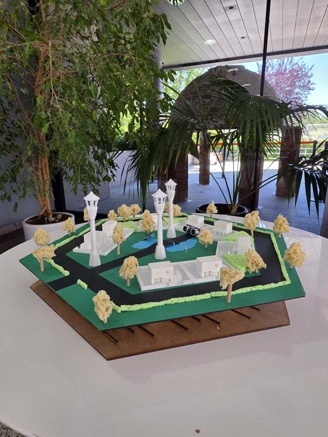
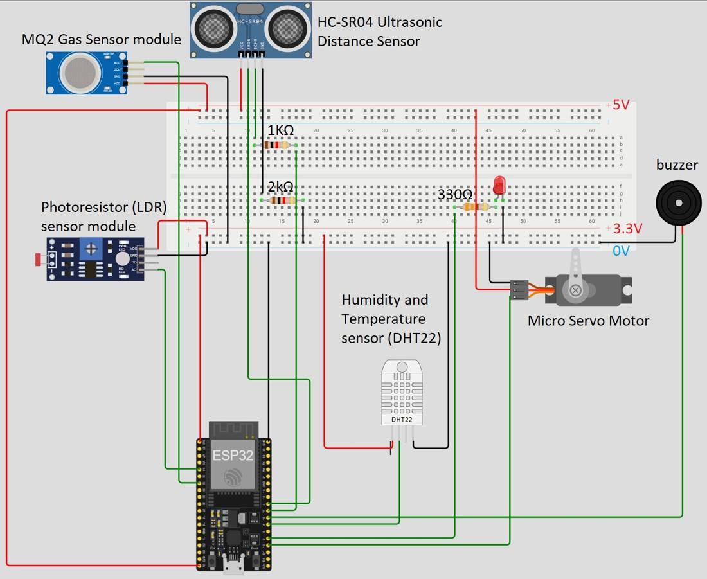
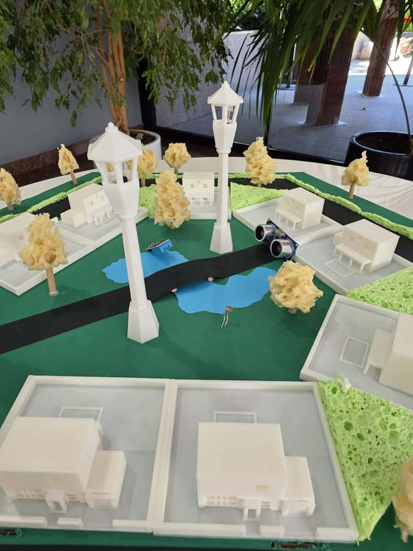
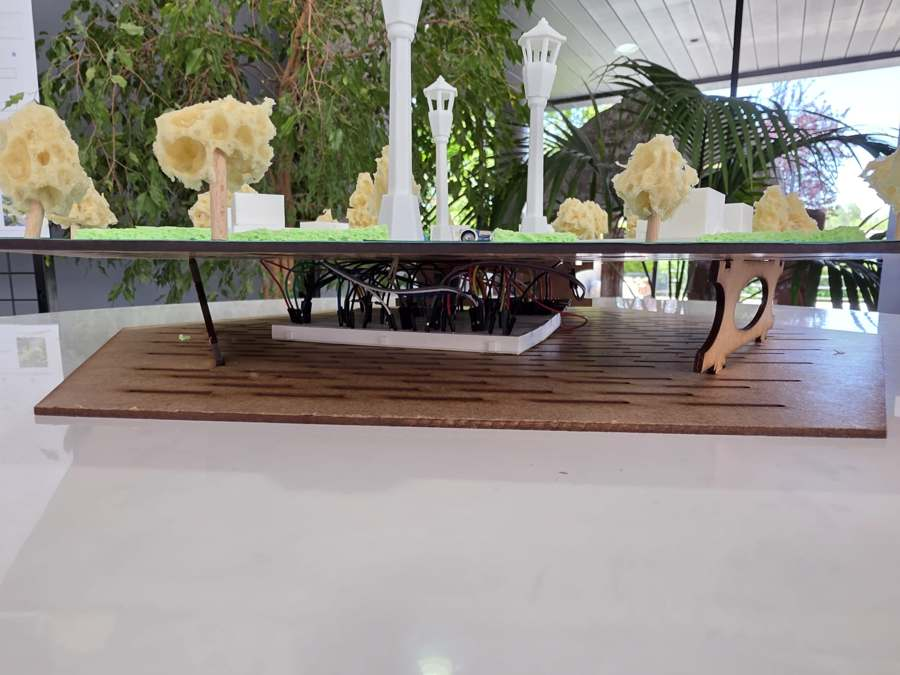
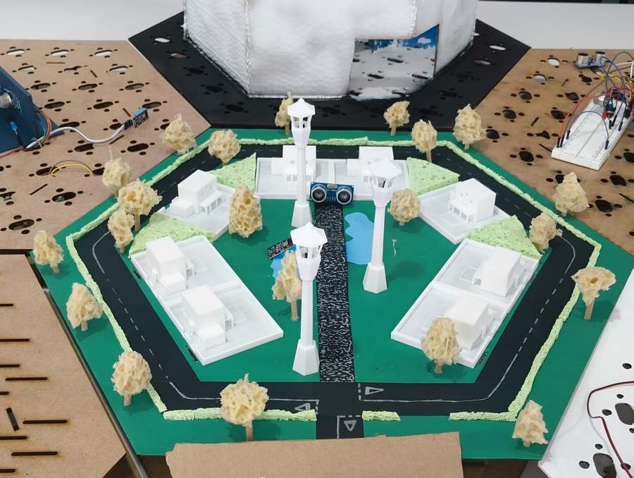

# AureaTech · Zona residencial inteligente

Maqueta a escala de un barrio que se monitoriza solo: farolas, casas, un lago y una calle con sensores reales conectados a un **ESP32**. Los datos viajan por WiFi a una aplicación de escritorio en **Python (Flet)** y se guardan en **MariaDB**.

Proyecto en equipo del Grado en Ingeniería Informática de la **Universidad Europea de Madrid**.

<p align="center">
  
</p>

---

## Qué hace

| Sensor / actuador | Para qué sirve en la maqueta |
|---|---|
| **DHT22** | Temperatura y humedad ambiente |
| **HC-SR04** | Distancia: detecta vehículos o personas en la calle de acceso |
| **LDR** | Nivel de luz para encender el alumbrado al anochecer |
| **MQ-2** | Detección de gas o humo |
| **Servo** | Barrera de acceso |
| **Buzzer + LED** | Alarmas y avisos |

El ESP32 lee los sensores y envía las lecturas por WiFi a la aplicación, que las almacena, las muestra en tiempo real y ejecuta reglas de automatización (por ejemplo, encender luces o lanzar una alarma).

```text
 sensores ──► ESP32 ──WiFi──► app Python (Flet) ──► MariaDB
                ▲                   │
                └──── actuadores ◄──┘  reglas de automatización
```

---

## Hardware

<p align="center">
  
</p>

Toda la electrónica va escondida bajo la base: una protoboard con el ESP32 y el cableado, sobre una estructura de DM cortada a láser.

<p align="center">
  
  
</p>

<p align="center">
  
</p>

---

## Stack

`ESP32` · `Arduino IDE` · `Python` · `Flet` · `MariaDB` · `PlantUML` · impresión 3D · corte láser

---

## Equipo

Trabajo en grupo de cuatro personas; todos participamos en el diseño, la electrónica, el software y la maqueta.

- **Daniel de Abajo** · [@danieldeab](https://github.com/danieldeab)
- **Paula Gómez Lucas** · [@paula-gomezlucas](https://github.com/paula-gomezlucas)
- **Pablo Serrano** · [@Pablster](https://github.com/Pablster)
- **Franco Zimmermann** · [@FrancoZimm](https://github.com/FrancoZimm)

> El código fuente vive en el repositorio privado del equipo. Este repo es una presentación del proyecto.
